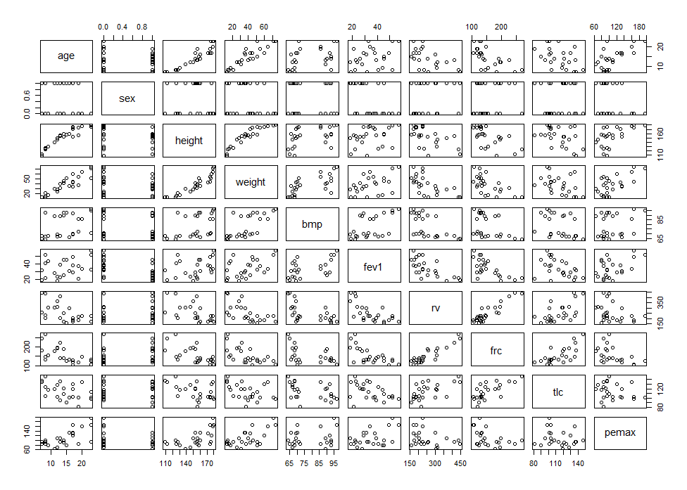
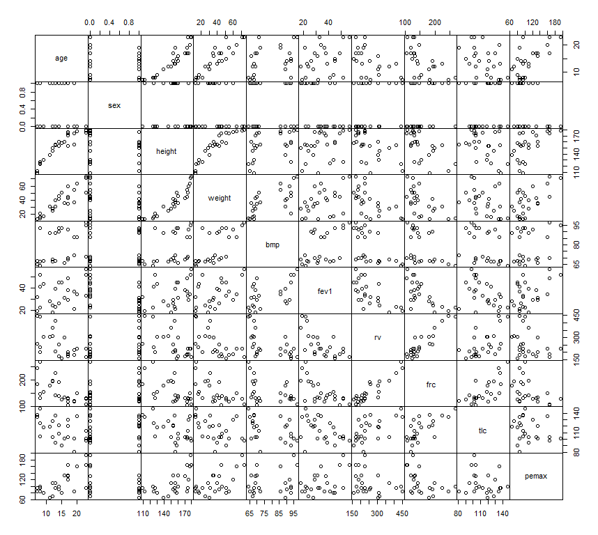

```{r general_options, include = FALSE}
knitr::knit_hooks$set(margin = function(before, options, envir) {
  if (before) par(mgp = c(1.5, .5, 0), bty = "n", plt = c(.105, .97, .13, .97))
  else NULL
})
knitr::opts_chunk$set(margin = TRUE, prompt = FALSE, comment = "##",
                      collapse = FALSE, cache = FALSE, autodep = TRUE,
                      dev.args = list(pointsize = 11), fig.height = 3.5,
                      fig.width = 4.24725, fig.retina = 2, fig.align = "center")

```

## Data processing

Here we show how to manipulate and visualize the data we retrieved from ```COVID19``` package which is created by [COVID-19 Data Hub](https://covid19datahub.io/index.html). First, we need to install the package ```COVID19```:
```
install.packages("COVID19")
```
In this package, it consisted 190 countries data included Malaysia
```{r,warning=FALSE}
library(COVID19)
```
In this session, we only cover Malaysia dataset. To retrieve the dataset of Malaysia, we need to use the ```covid19()``` function:
```{r}
x <- covid19("MYS")#MYS = Malaysia
```
[COVID-19 Data Hub](https://covid19datahub.io/index.html) provided many variables in the dataset, we can check it:
```{r}
names(x)
```
The details for each variable can reviewed at [here](https://covid19datahub.io/articles/doc/data.html). Since the dataset did not provide the number of incidence per day, then we need to compute the daily incidence based on the data. As we know the daily number of new cases is defined as the total number of confirmed cases of today minus the total number of confirmed cases of yesterday. Notice that there are some missing values on the first few data of the attribute confirmed, thus, we can assume them as 0 in this scenario:
```{r}
x$confirmed[is.na(x$confirmed)] <- 0

```
Hence we can compute using the code below:
```{r}
#Method 1
incidence <- c() #create an empty vector to hold all the incidence  
for(i in 1:length(x$confirmed)){
  temp <- x$confirmed[i+1]-x$confirmed[i] 
  incidence <- append(incidence,temp)
}
length(incidence)
length(incidence)==length(x$confirmed)
```
Or we can use the properties of data frame:
```{r}
#Method 2
incidence <-tail(x$confirmed,-1) - head(x$confirmed,-1)
length(incidence)
length(incidence)==length(x$confirmed)
```
In **method 2**, the ```tail(x$confirmed,-1)``` is removed the first row/element of ```x$confirmed``` while ```head(x$confirmed,-1)``` is removed the last row/element of ```x$confirmed```. To calculate the difference between the row/element, we will using **next** value minus **previous** value. Let's say now we have 12 elements in a vector named ```exp_vector```:
```{r}
exp_vector <- c(0,0,0,3,4,4,4,7,8,8,8,8)
exp_vector
```
We try to assign the index as the name for each element in ```exp_vector```:
```{r}
names(exp_vector)<-c(1:12)
exp_vector
```
We want to compute the different between each element in ```exp_vector```, the pseudocode is look like below:
```
d1 <- exp_vector[2]-exp_vector[1]
d2 <- exp_vector[3]-exp_vector[2]
d3 <- exp_vector[4]-exp_vector[3]
...

d11 <- exp_vector[12]-exp_vector[11]
```
Let we using method 2 above to compute the difference between each element in ```exp_vector```:
```
tail(exp_vector,-1) - head(exp_vector,-1)
```
We try to devide the code and see it one by one:
```{r}
exp_vector
#What will show in tail(exp_vector,-1)
tail(exp_vector,-1)
```
```{r}
#What will show in head(exp_vector,-1)
head(exp_vector,-1)
```
Now, let's us combine both and see the output:
```{r}
diff <- tail(exp_vector,-1)-head(exp_vector,-1)
names(diff)<-c(1:length(diff))
diff
```
The logic behind the method 2 is: First, our aim is to generate two new vector from ```exp_vector```. The index for ```tail(exp_vector,-1)``` is ```2  3  4  5  6  7  8  9 10 11 12``` and the index for ```head(exp_vector,-1)``` is ```1  2  3  4  5  6  7  8  9 10 11```. We can see that the ```tail(exp_vector,-1)``` is from 2 to 12 while ```head(exp_vector,-1)``` is from 1 to 11. If we doing ```tail(exp_vector,-1)-head(exp_vector,-1)``` is mean that the index 2 in ```tail(exp_vector,-1)``` which is 0 is minus the index 1 in ```head(exp_vector,-1)``` which is also 0. Thus, this is identical with our pseudocode shown before. Therefor we can compute the different between each row/elements by using method 2.  

The only difference between this two method is the length of output. We can leave the output like this or we can insert into the data frame. Note that the length of every attributes in the data frame must be same. If using method 2, we need to insert NA last of ```incidence``` vector:
```{r}
incidence[length(incidence)+1] <- NA
length(incidence)==length(x$confirmed)
x$incidence <- incidence
```
Now we have new attributes in our dataset:
```{r}
names(x)
```

### Excersice
Since the dataset only provide total number of confirmed cases, recovered cases and deaths. Now let's try to calculate the number of active cases using formula below and insert into dataframe ```x```:
$$
ac(t) = cc(t) - rc(t) - dc(t)
$$
$$
\\where:  
\\ac(t) = number\;of\;active\;cases\;at\;time\;t,
\\cc(t) = total\;number\;of\;confirmed\;cases\;at\;time\;t,
\\rc(t) = total\;number\;of\;recovered\;cases\;at\;time\;t,
\\dc(t) = total\;number\;of\;deaths\;at\;time\;t,
\\t =1,2,3,...,T
$$

Some values are missing in the attributes of recovered and deaths, we can assume those missing data as 0 in this scenario:
```{r}
x$recovered[is.na(x$recovered)] <- 0
x$deaths[is.na(x$deaths)] <- 0
```

Solution:
```{r}
x$active <- x$confirmed - x$recovered - x$deaths
names(x)
head(x$active)
tail(x$active)
```

## Data Exploration
The dataset consists the data from year 2020 to 2021 July, let's try to seperate the data with year:
```{r}
x2020 <- x[x$date <= '2020-12-31',]
head(x2020)
tail(x2020)
x2021 <- x[x$date > '2020-12-31',]
head(x2021)
tail(x2021)
```
Now we focus on year 2020, let's us visualize some of the attributes:
```{r,fig.align = "center"}
attr_list <- c(5,6,7,37,38)#index of attribute
par(mfrow = c(5,1))
for(attrX in attr_list){
  barplot(x2020[[attrX]],space=0,xlab = NA,ylab = 'Total')
  mtext(names(x2020[attrX]),line=-1)
}
```

### Exersice
Now let's try with same attributes for year 2021  

Solution:
```{r,fig.align = "center"}
attr_list <- c(5,6,7,37,38)#index of attribute
par(mfrow = c(5,1))
for(attrX in attr_list){
  barplot(x2021[[attrX]],space=0,xlab = NA,ylab = 'Total')
  mtext(names(x2021[attrX]),line=-1)
}
```

## Data Analysis
### Multivariate Data
We will using data in ```ISwR``` package. First, let's install ```ISwR```:
```
install.packages("ISwR")
```
The data we will using is ```cystfibr```:
```{r}
library(ISwR)
data("cystfibr")
cystfibr
str(cystfibr)
```
Let's see what is the output when plotting:
```{r, fig.show='hide'}
plot(cystfibr)
```
```{r,echo=FALSE,out.width='100%'}

```
We can plot the multivariate data in this way:
```{r, fig.show='hide'}
# mex is parameter reduces the interline distance in the margin
#gap=0 is remove the space between subplot; cex.labels is adjust the font size

par(mex=0.5) 
pairs(cystfibr,gap = 0,cex.labels = 0.9) 
```
```{r,echo=FALSE,out.width='100%'}

```
Using ```lm()``` to run a regression analysis:
```{r,echo=FALSE}
pemaxReg<-lm(pemax~age+sex+height+weight+bmp+fev1+rv+frc+tlc,data = cystfibr)
summary(pemaxReg)
```