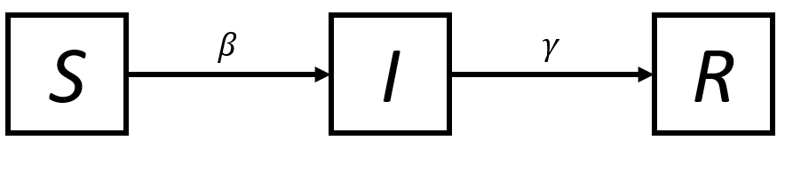

## SIR model
### Compartmental diagram
Three variables are defined in our model which are i) ***S*** Susceptibles, ii) ***I*** Infectious and iii) ***R*** Recovered. Susceptibles become infected at a rate equal to the product of an infectious contact rate $\beta$ and the number of infectious ***I***. Infectious people recover at a rate $\gamma$
```{r,fig.align = 'center',echo=FALSE}

```

### Formulation  
$$
\frac{dS}{dt} = -\beta IS\\
\frac{dI}{dt} = \beta IS -\gamma I\\
\frac{dR}{dt} = \gamma I
$$  
Based on the formulation, basic reproduction number, $R_{0}$ is defined as below:
$$
R_{0}= \frac{\beta}{\gamma}N
$$
## Numerical Solution of SIR model in R
As mentioned before, to obtain numerical solution of differential equation in R, we are required to use the function ```ode()``` under ```deSolve``` package. To be able to use the deSolve package, you need to load it:
```{r}
library(deSolve)
```
### Step 1: Define SIR model in R
We need to define the differential equations of SIR model in script. We create a function to define our SIR model:
```{r}
sir_equations <- function(time, variables, parameters) {
  with(as.list(c(variables, parameters)), {
    dS <- -beta * I * S
    dI <-  beta * I * S - gamma * I
    dR <-  gamma * I
    return(list(c(dS, dI, dR)))
  })
}
```
We use the ```with()``` function in the function ```sir_equations()```. The ```with()``` works on lists only, not on vectors.

### Step 2: Defining value for the parameters 
In the SIR model defined above, 2 parameters are included in the model which are $\beta$ and $\gamma$. We need to assign value to these two parameters:
```{r}
parameters_values <- c(
  beta  = 0.004, # infectious contact rate (/person/day)
  gamma = 0.5    # recovery rate (/day)
)
```

### Step 3: Defining initial values for the variables
Since the SIR model is an initial value problem (IVP), we need to assign the initial value to these variables:
```{r}
initial_values <- c(
  S = 999,  # number of susceptibles at time = 0
  I =   1,  # number of infectious at time = 0
  R =   0   # number of recovered (and immune) at time = 0
)
```

### Step 4: Defining the time points of simulation
We want to know the values of our SIR model variables at these time points:
```{r}
time_values <- seq(0,10) #days
```

### Step 5: Solving the SIR model numerically
We have defined 4 objects:
```{r}
ls()
```
```{r}
sir_equations
parameters_values
initial_values
time_values
```
If everything are fine, now we need to use ```ode()``` function from ```delSove()``` package to solve our model numerically:
```{r}
sir_values_1 <- ode(
  y = initial_values,
  times = time_values,
  func = sir_equations,
  parms = parameters_values 
)
```
The numerical solution of our SIR model is:
```{r}
sir_values_1
```
To use these value for further analytical steps, we can convert ```sir_values_1``` into data frame.
```{r}
sir_values_1 <- as.data.frame(sir_values_1)
sir_values_1
```
After we converted ```sir_values_1``` into data frame, now we can use ```with()``` function to make our life easier:
```{r, fig.align='center'}
with(sir_values_1, {
# plotting the time series of susceptibles:
  plot(time, S, type = "l", col = "blue",
       xlab = "time (days)", ylab = "number of people")
# adding the time series of infectious:
  lines(time, I, col = "red")
# adding the time series of recovered:
  lines(time, R, col = "green")
})

# adding a legend:
legend("right", c("susceptibles", "infectious", "recovered"),
       col = c("blue", "red", "green"), lty = 1, bty = "n")
```
The value of the $R_{0}$ is
```{r, results=FALSE}
(999 + 1) * parameters_values["beta"] / parameters_values["gamma"]
```
```{r,,echo=FALSE}
(999 + 1) * 0.004/0.5
```
## Exercise
### Writing a SIR model simulator
Use the code examples above to write a ```sir_1()``` function that takes

* parameter values ($\beta$ and $\gamma$)
* initial values of (*S*,*I*,*R*)
* time points  

as input arguments to run the SIR model and returns a data frame of time series as an output as below:
```{r}
sir_1 <- function(beta, gamma, S0, I0, R0, times) {
  require(deSolve) # for the "ode" function
  
# the differential equations:
  sir_equations <- function(time, variables, parameters) {
    with(as.list(c(variables, parameters)), {
      dS <- -beta * I * S
      dI <-  beta * I * S - gamma * I
      dR <-  gamma * I
      return(list(c(dS, dI, dR)))
    })
  }
  
# the parameters values:
  parameters_values <- c(beta  = beta, gamma = gamma)

# the initial values of variables:
  initial_values <- c(S = S0, I = I0, R = R0)
  
# solving
  out <- ode(initial_values, times, sir_equations, parameters_values)

# returning the output:
  as.data.frame(out)
}
```
```{r}
sir_1(beta = 0.004,gamma = 0.5,S0=999,I0=1,R0=0,times = seq(0,10))
```