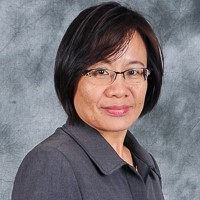

```{r,fig.align = 'left',echo=FALSE}

```

Welcome to the 7th Disease Modeling Workshop! We are delighted to have you here with us for the next 3 + 1 days. Indeed it will be intensive but I am sure you will benefit from this workshop. 

The Faculty of Computer Science and Information Technology, UNIMAS initiated the Disease Modeling Workshop in 2014 with the aim to bring together researchers in Applied Mathematics, Computer Science and Public Health in one platform to share knowledge and current research activities mainly in facilitating the eradication and control of infectious diseases. Since then, the workshop has become an annual event not only for sharing knowledge but also to gauge research collaboration.
However, since the COVID19 pandemic hit us, we had to postpone our 7th run to this year instead of 2020. Despite the challenges we faced during this trying time, we decided to proceed the workshop virtually as we have received few requests for the workshop.

We shall begin the workshop with some overview of disease models and sharing some experiences in COVID19 model projections we did for the country and state. Then, we provide the fundamentals of R programming language and moving towards using it in solving disease problems. Prior to that, you will be exposed to compartmental modeling on disease transmissions and understand the time-series analysis on disease data. As before, we will deal only on infectious disease transmission from the fundamental formulation of the model to the analysis of the solutions obtained. Additionally, participants are expected to complete a group project of which you will get to present the work probably a few weeks later. This is a great opportunity for the participants to engage in a group research work and deliberate on the outcome with the facilitators.

I am in deep appreciation to our Dean, Associate Professor Dr Kartinah Zen for her continuous support and motivation; and my able colleagues and research assistants at the Faculty of Computer Science & Information Technology and Institute for Social Informatics and Technological Innovations, who have always made themselves available to assist in the organizing of the workshop. My immense gratitude to my graduate research assistant Hong Boon Hao, COVID-MySim co-inventor, for rendering expertise for the workshop. My sincere thanks goes also to the UNIMAS Business School, PROCEL Manager and Coordinator for providing support and continuous administrative and technical assistance for smooth organization of the event. To my wonderful organizing team, thank you for working tirelessly showing true dedication and determination. I am truly graced with colleagues like you.

Last but not the least, I thank you - our participants for joining this workshop. I know that three days to be away from your routine work perhaps may cause things to be piled up when you return to it, but I am confident that the discussions held during this workshop will lead us to stronger research collaboration.

Let me take this opportunity to apologize for any shortcomings in the organizing of the event. We hope that you will have an enjoyable workshop with productive deliberations. 


Let us have a successful DMo!

**Associate Professor Dr Jane Labadin**  
Chairman DMo 2021
